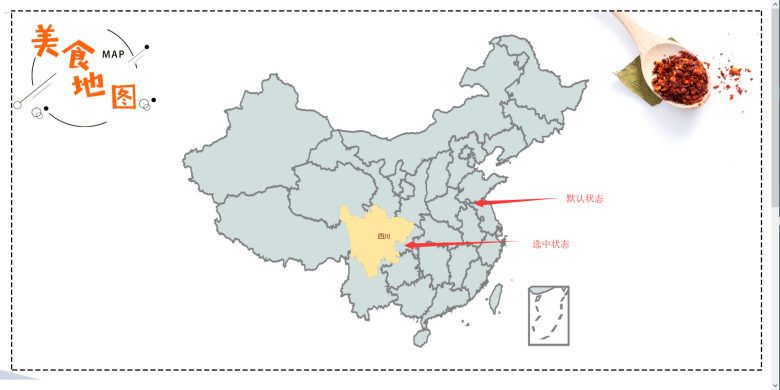
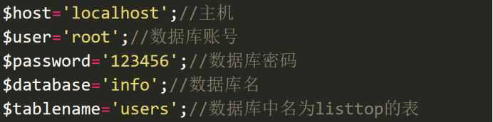
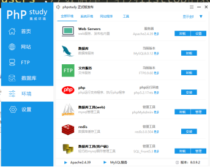
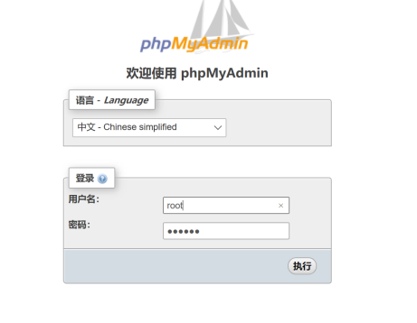
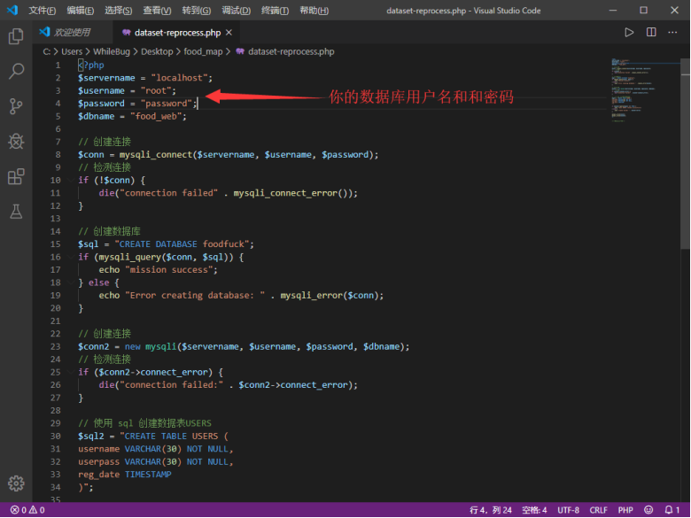

# China_Food_Map
Web前端程序设计课设
## 简介
传统的美食网站一般是按照口味等方式对不同的美食进行分类。而中国之大，不同地区都有不同的菜品风格；于是我们决定按照传统的八大菜系再加上西北菜和东北菜总结出的十大菜系，用echarts绘制出中国地图，按照各个省的不同菜系进行分类。同时还创新性地采用食材的分类索引到不同的美食菜谱。我们的项目拥有5张主要页面，包括：主导页面，地图分类页面，菜系页面，食材分类页面即美食单页88张小页面。同时采用数据库存储用户信息和菜品信息，拥有登录功能。
## 界面展示

## 网站结构
## 网站配置说明
此用户说明书的Sql使用载体为PHPStudy，将全面围绕在PHPStudy上进行使用。设置用户名为root，密码为123456。（若为其他账户及密码需要修改php代码）
菜谱数据库设置：
此处改为你相应的信息即可

图1
在环境中下载s数据库工具，并点击管理。

图2
登陆phpstudy

图3
将数据库的info.sql、sort.sql导入

图4
导入后数据库即配置成功。
切记：php一定要单独放在www下面。否则依然需要在代码中修改路径。

图5
用户信息数据库设置：

图6
打开phpstudy，输入127.0.0.1/food_map/dataset-reprocess，运行我写好的数据库配置文件，即完成用户信息数据库的设置
